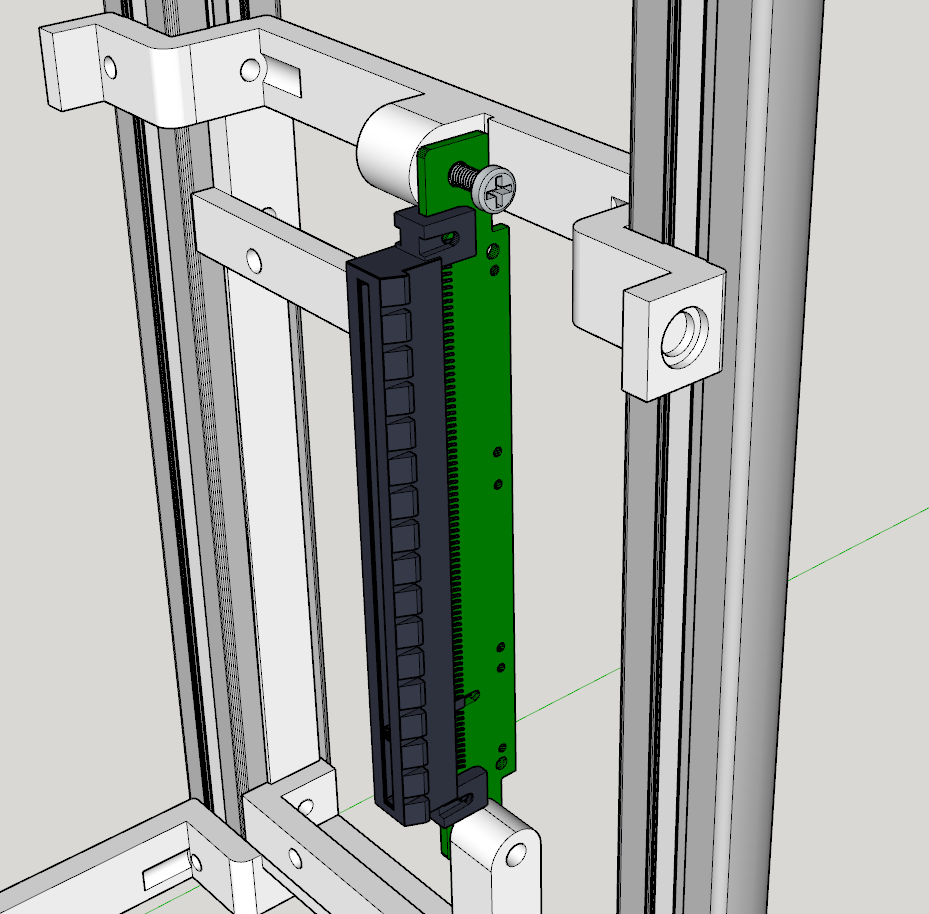
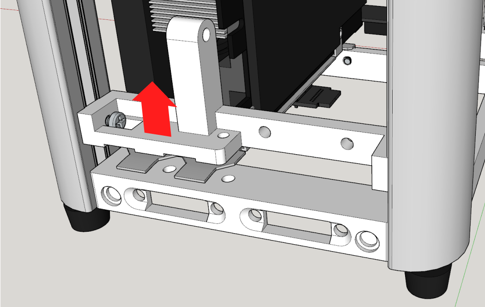
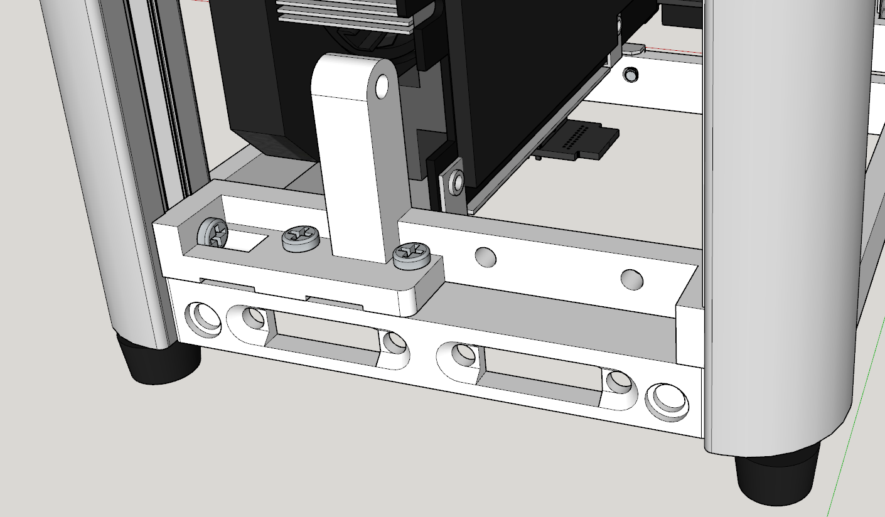

# Building Basalt

This guide is split up in 2 parts: assembling the case and inserting the hardware.

## Assembly

Start by attaching the extrusions to the bottom part. Be careful at this point because the extrusions won't be held into place very well yet so the may still fall over and damage the attached parts in the process.

We'll start with the front. You'll have to slide the parts in the extrusions from the top of the case once the bottom has been attached.

If you have printed the extrusion inserts, now is the time to insert the two number 1s in the front. If you haven't please consider again because this is hard without and you'll have to use the hardware later on to get the measurements.

With the extrusion inserts into place, you can now attach the motherboard bottom front.

Next, insert both extrusion inserts labeled number 2. You'll now know where to attach the motherboard top front part.

Before attaching the top, we'll first have to attach the back parts.

The PSU bottom part is first. Don't tighten this too hard yet, we'll have to loosen it again to insert the GPU later on when assembling the hardware.

Insert the extrusion insert number 3 on the motherboard side and then the PSU bottom on top.

Insert number 4 goes on the GPU side and the motherboard bottom back should rest on the PSU top part and the extrusion insert.

The final piece, the top, should be aligned nicely with the top of the extrusions and thus need no extrusion inserts.

Only thing left now is the accessories: the front I/O and the riser. The riser screws into the PSU bottom part and the motherboard bottom back.

The front I/O simply screws into the bottom part on the front. Make sure to insert it upside down or it won't line up with the front panel.

## Inserting the hardware

To insert the hardware, we'll temporarily take out the top printed part. We'll insert it again throughout the hardware process.

We'll start out with the largest part, the GPU. To insert the GPU, we first have to slide up the PSU bottom part a bit because the PCI tab will have to come between the bottom part and the PSU bottom part. The PSU bottom part is held into place by the extrusion inserts and the riser, so you may want to slide up the whole thing or take out the extrsusion inserts and the riser temporarily.

The easiest is to insert the GPU itself is at an edge from the side of the case. If you have a very large card, this may not be possible. I would then advice to insert it from the top but be carefull not to damage parts with the PCI bracket.

Push the PSU bottom all the way down and make sure the PCI bracket is held well into place. Tighten the PSU bottom part into the extrusions again and insert the extrusion inserts again.

Screw in the PCI tab on the bottom. If the front IO is too inconvinient, you can also temporarily take it out.

The motherboard goes in next. Install the memory and CPU cooler before you put it into the case. If your CPU cooler blocks access to certain ports, insert those cables already.

The board is inserted from the top and at this point there should be only 3 mounting points available. After you've screwed the board to those 3 points, you can insert the top part again and screw the board to the fourth point.

Now comes a tricky part: the riser cable. Lay it out horizontally so you can see where the bend needs to come. Start by gently bending the riser and lining it up with the PCI connector on the motherboard. When you're certain the it's lined up well, pinch the bend together so it gets as tight as possible without damaging the riser.

Next is the PSU. I would advice to already plug in the cables you require before inserting it into the case. Make sure the fan is facing outwards so it doesn't suffocate.

Take care when mounting the PSU to the printed parts as this is the only part that uses 6-32 screws.

When the PSU is inserted, you can route the cables and insert the into the components. There is some room in front of the PSU for excess cabling when using a standard SFX PSU.

We're almost ready now, only some minor things left. The video output extensions can be mounted to the case and inserterd in the GPU. It requires countersunk M4 screws. Don't overtighten countersunk screws as they will break the plastic parts!!

Last and optional step is the top fan. The fan attaches to the top panel with 4 self tapping screws. Insert the cable in the motherboard and you can start mounting the panels with the top panel. Screw the panel in the extrusion tops with the large M6 screws.

**IMG** **IMG**

The bottom is next, which is screws into the extrusion using the case feet with attached M6 threads.

**IMG**

The remaining panels are attached using the magnets, easy enough.

**IMG**

You are now done, hooray!