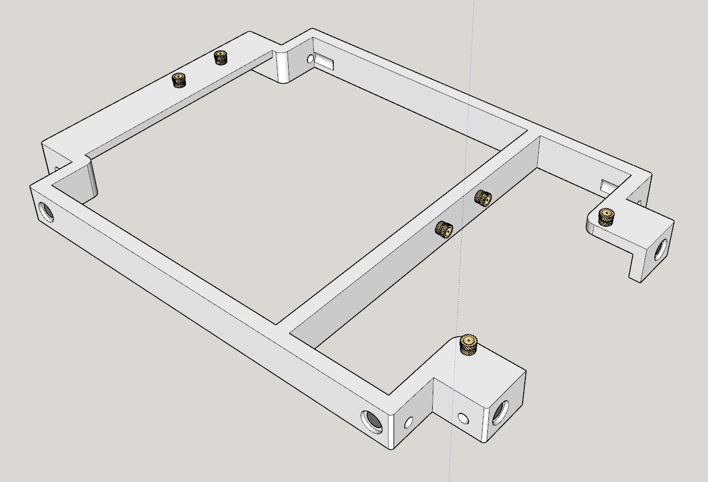
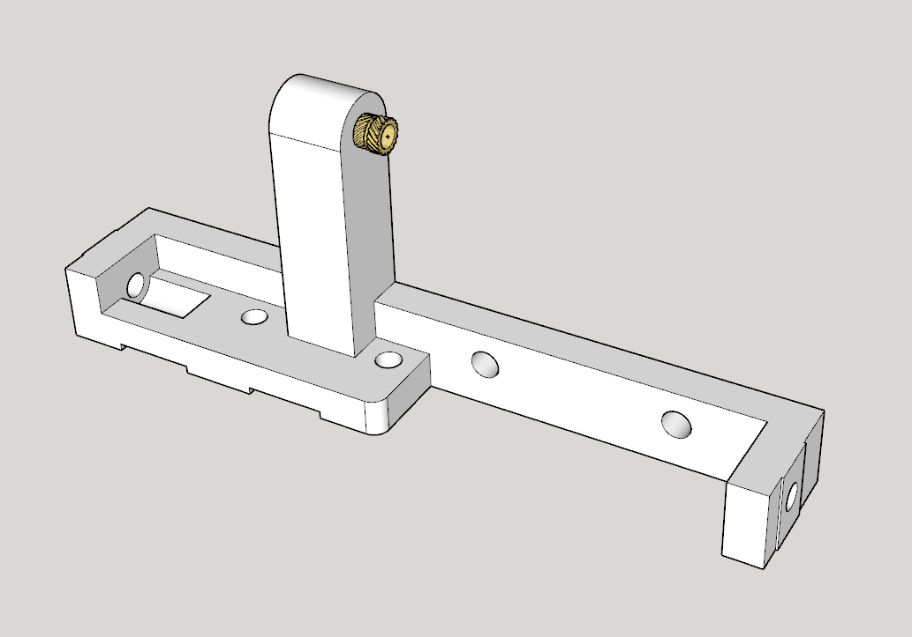
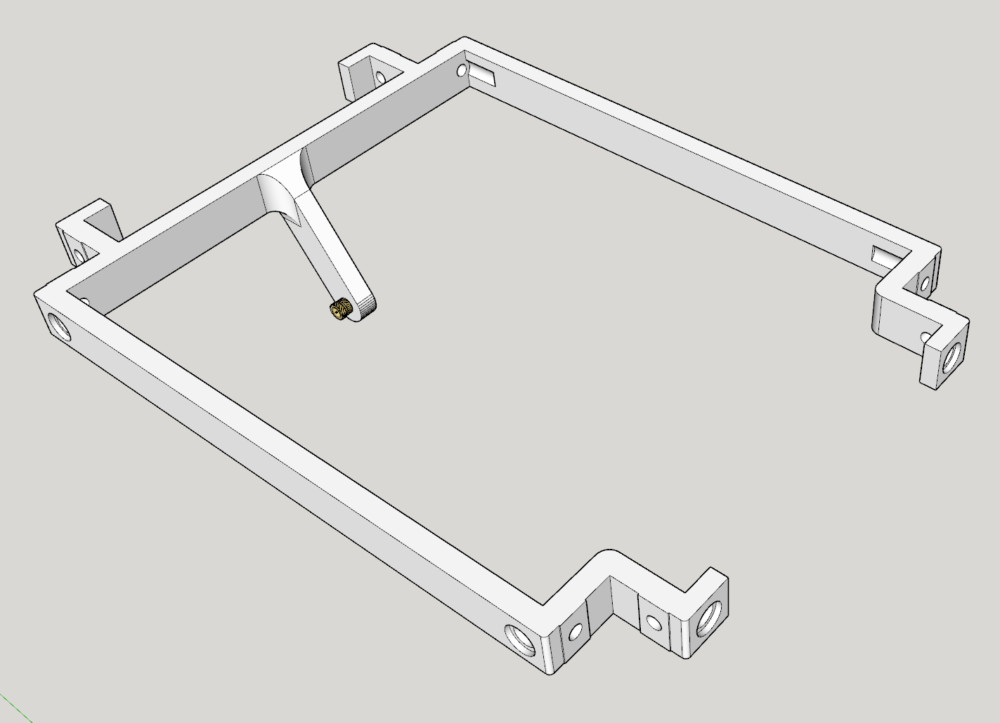

# Preparing the parts

Looks like you've succeeded collecting all required parts, which is a challenge to start with. Well done! Now let's get building.

## Glueing the magnets

The printed parts have a recess where the magnet will need to be glued. The smaller part hold the magnet that is glued to the 3D printed part, the larger part holds the magnet that is glued to the case panel.

The glue I used was 'UHU Max Repair' and this worked well.

**Case panel glue**

## Inserting threaded inserts

Threaded inserts are melted into certain parts with a soldering iron so we can screw into them without wearing out the plastic.

For a general guide about inserting threaded inserts, refer to the following movie: https://www.youtube.com/watch?v=GP1qrN-ONTA
However, I would advice you to not use so much force pushing in the inserts as we're working with smaller ones.

There are several pieces that require threaded inserts:

### Bottom

The bottom requires the following inserts:

* 2x 4mm inserts for the front IO
* 2x 4mm inserts for the GPU PCI tab
* 2x 3mm inserts for the GPU PCI clamp (above the video outputs)

### PSU Bottom

The PSU bottom needs one insert for the riser.

### Motherboard parts x3

The three individual motherboard parts all need inserts to mount the motherboard. Make sure you check what the front and the back are so you insert the the right direction. The top of the insert should be the non-chamfered edge because that's where the motherboard comes.

The motherboard bottom back part also needs an insert for the riser.

### Top

Finally, the top also needs one insert for the last motherboard mount. There is no way of checking for non-chamfered sides here, but you can make out the sides because this part is not symmetrical.

## Attaching the T-nuts

The T-slot nuts will slide into the extrusion and the printed parts are then screwn into the nuts. This is hard to do when the nuts slide all over the place, so I prefer to attach the nuts to the parts before sliding them into the extrusion.

You can do so by screwing the nuts to the part with the M3x10mm screws, but don't tighten it yet as you won't be able to slide them in the extrusion anymore. Do this for all parts that require T-slot nuts, which are the following:

* Bottom: 8 nuts
* PSU bottom: 2 nuts
* PSU top: 1 nut
* Motherboard bottom back: 4 nuts
* Motherboard bottom front: 3 nuts + 1 nut for the optional piece
* Motherboard top front: 2 nuts
* Top: 8 nuts
* (optional) GPU holder: 2 nuts (see opional pieces for more info)