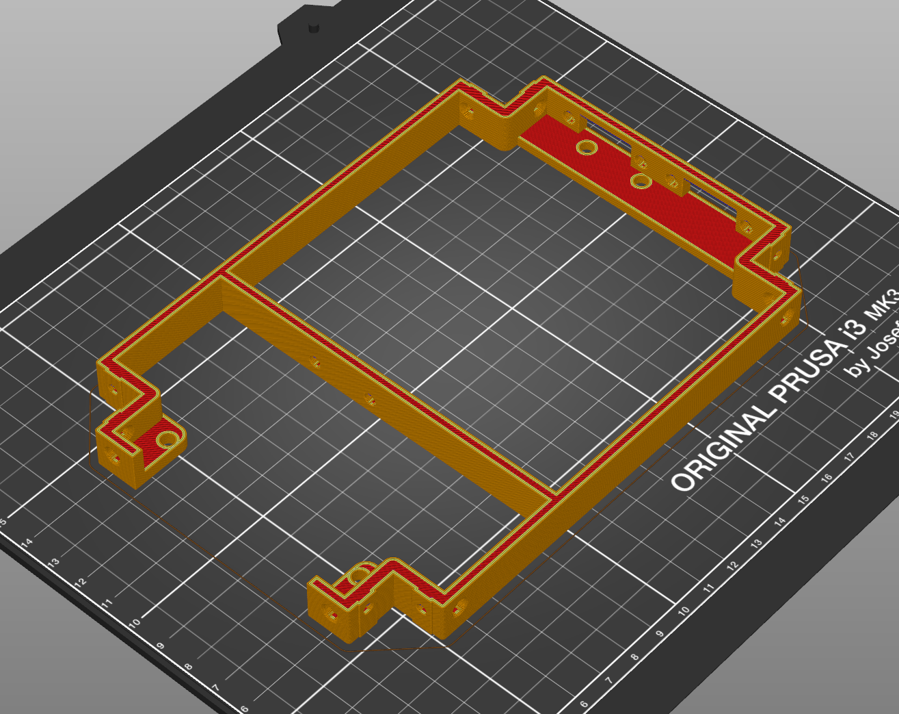

# Bottom printed part

The bottom part connects all extrusions, holds, 8 magnets for all panels, holds the USB hub and has screw holes for the GPU PCI bracket and the video output extensions.

This part can be printed without support by printing it upside down.

