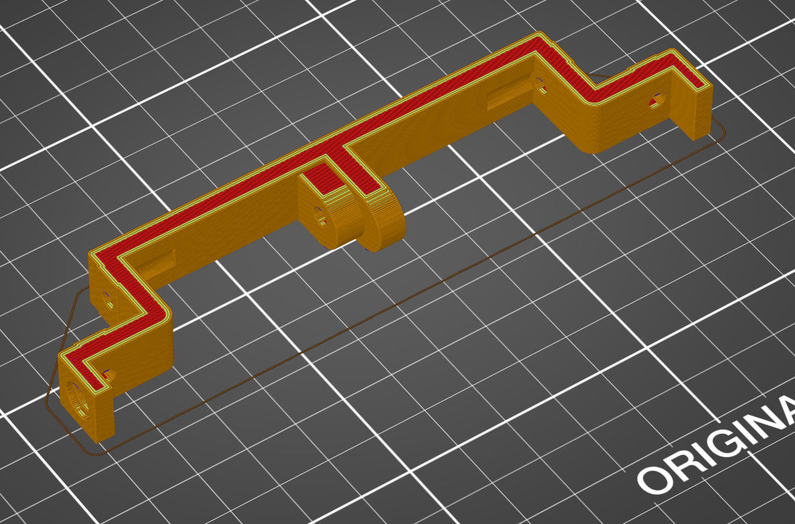

# Motherboard bottom back

This part connects the motherboard bottom back to the 2 back extrusions and had room for 4 magnets For the back and 2 side panels.

This part can be printed without support provided that your printer can print overhangs of about 50 degree.

