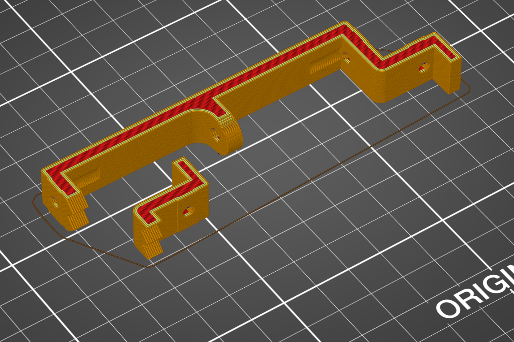

# Motherboard bottom front

This part connects the motherboard bottom front to the 2 front extrusions and has room for 4 magnets for the front and 2 side panels.

This part is split up in 2 parts so that you can ommit the smaller part when you have a very tall GPU. You will probably need some support under the tabs that connect the 2 parts.

