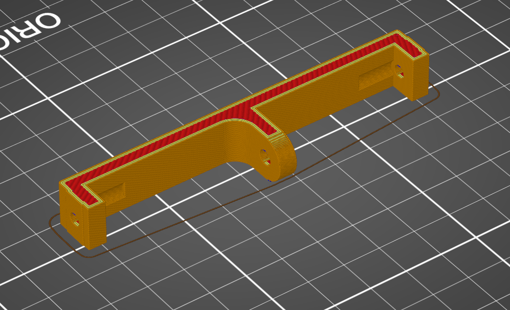

# Motherboard bottom front

This part connects the motherboard bottom front to the 2 front extrusions and had room for 4 magnets For the front and 2 side panels.

This part can be printed without support provided that your printer can print overhangs of about 45 degree.

