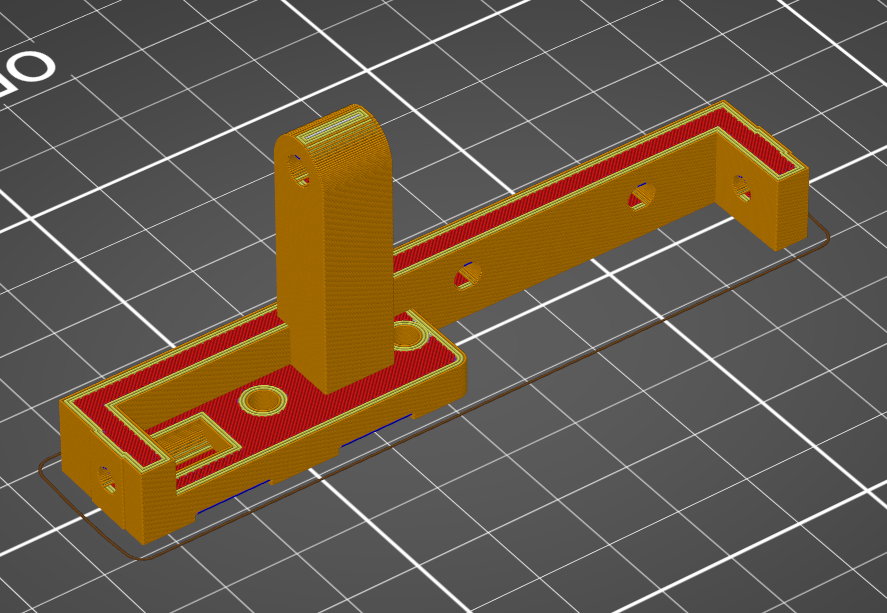

# PSU bottom

This part has several uses. It connacts the bottom of the PSU to the 2 back extrusions while also clamping the PCI bracket of the GPU into place. Print upside down for and easy supportless print.

