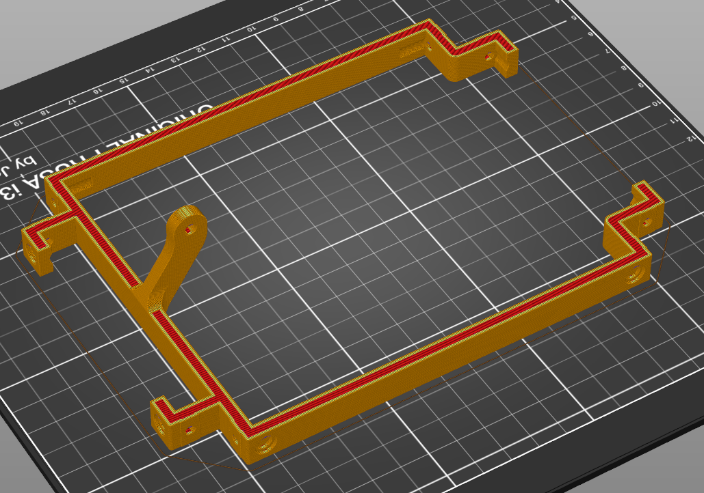
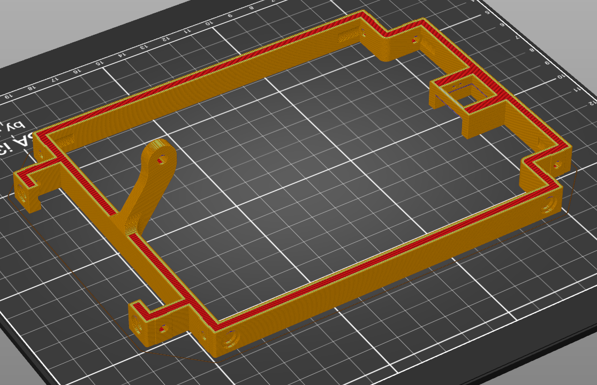

# Top

There are 2 options for the top parts, which differ in the power button they support. Make sure to pick the corresponding laser cut top panel.

## Vandal power button

This is probably the most common way of providing a power button to a DIY computer case: the vandal switch. This part leaves room for 16mm vandal switch.

This part is pretty easy to print. No support required, a brim of about 5mm could be prefered if your printer is prone to prints warping.

## LEGO keycap power button

This option allows for a custom lego brick to be mounted on a keycap to use as a power button. For the less serious approach.

This part may need some minor support on the keycap holding part. You may also add a brim of about 5mm couldif your printer is prone to prints warping.

