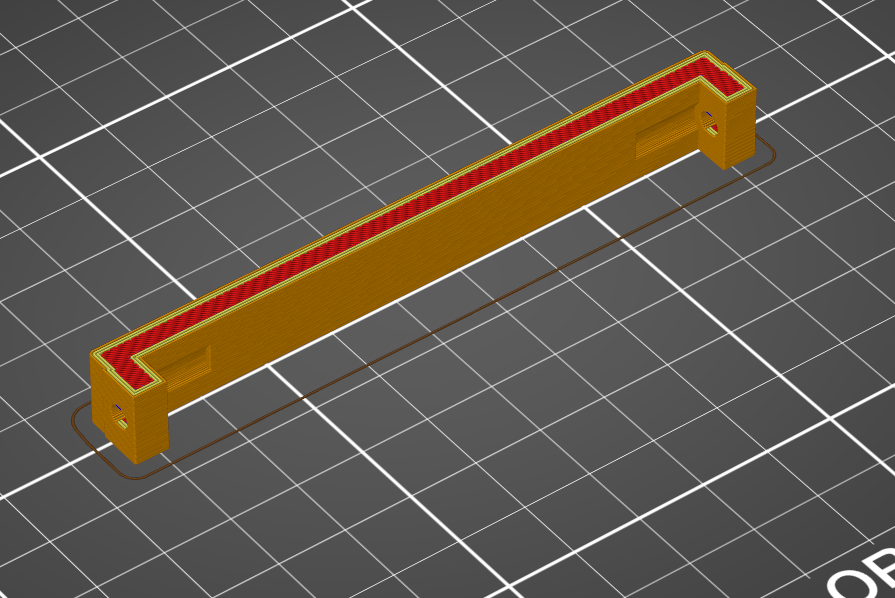

# Cable holder

Thios optional part can be used if the front panel gets pushed out by the cables of the 24 pin ATX connector. It mounts between the two front extrusions and can keet the cable mess at bay.

